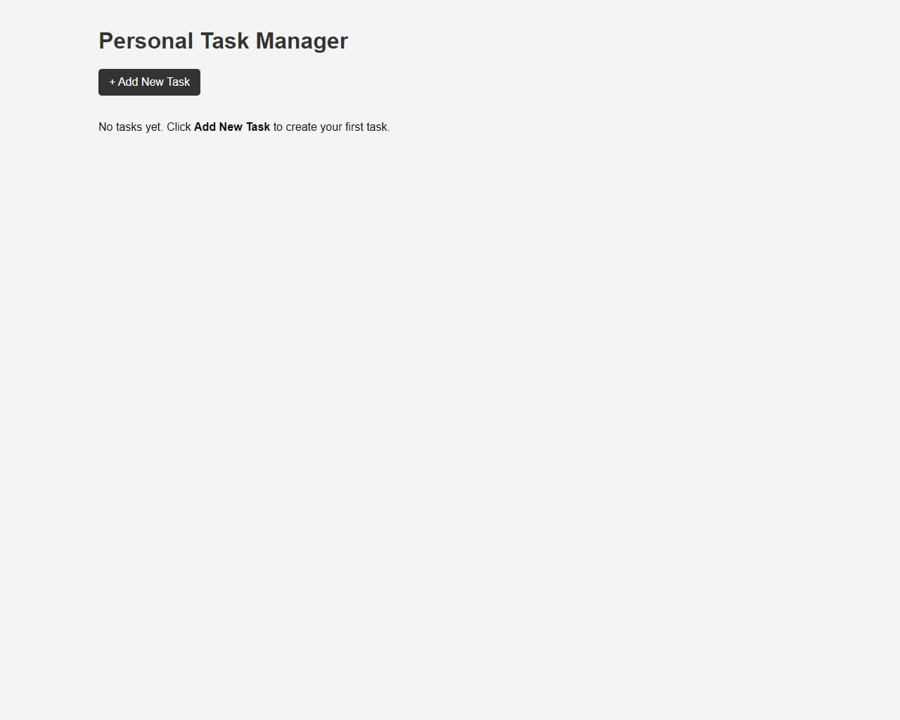
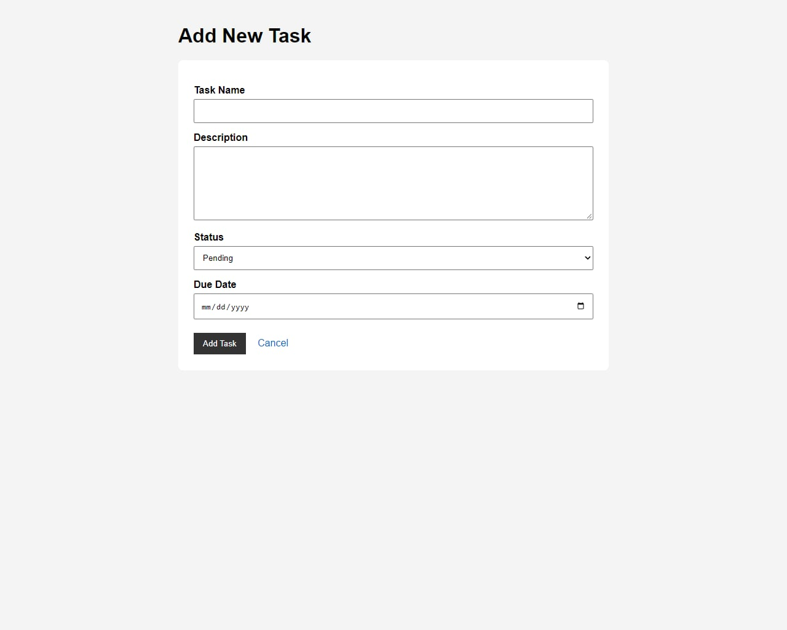
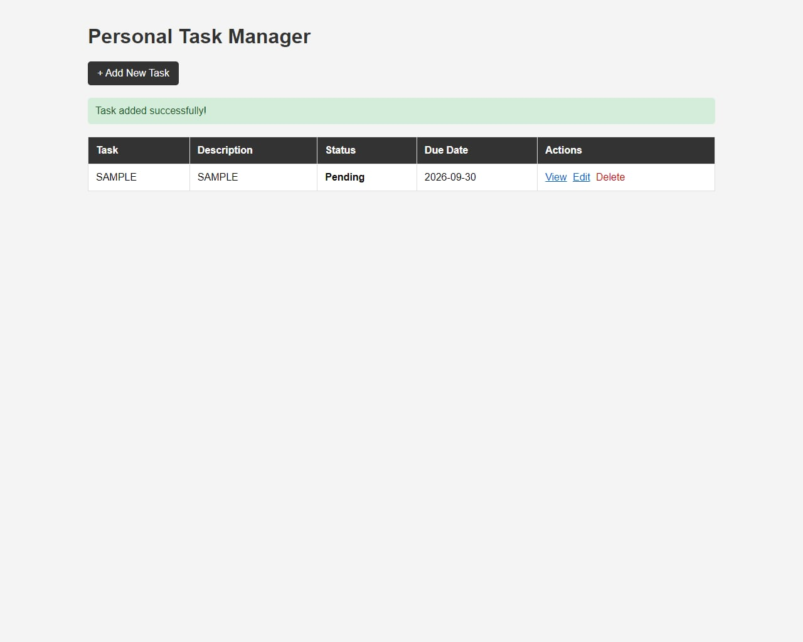
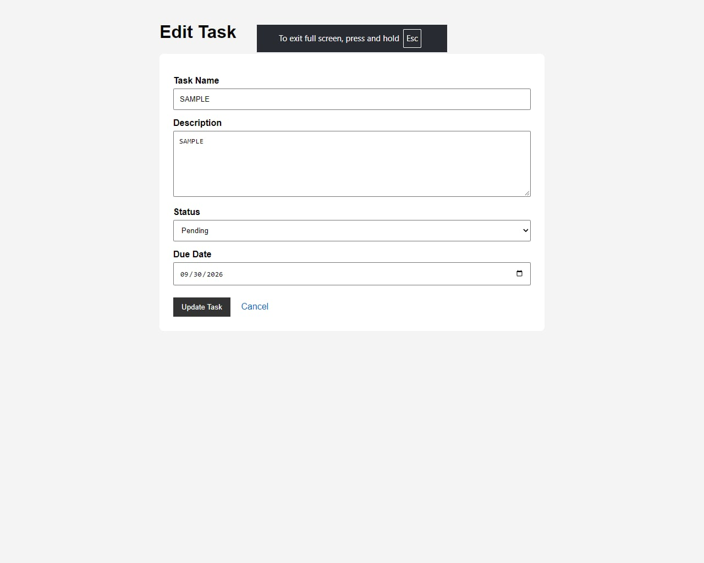
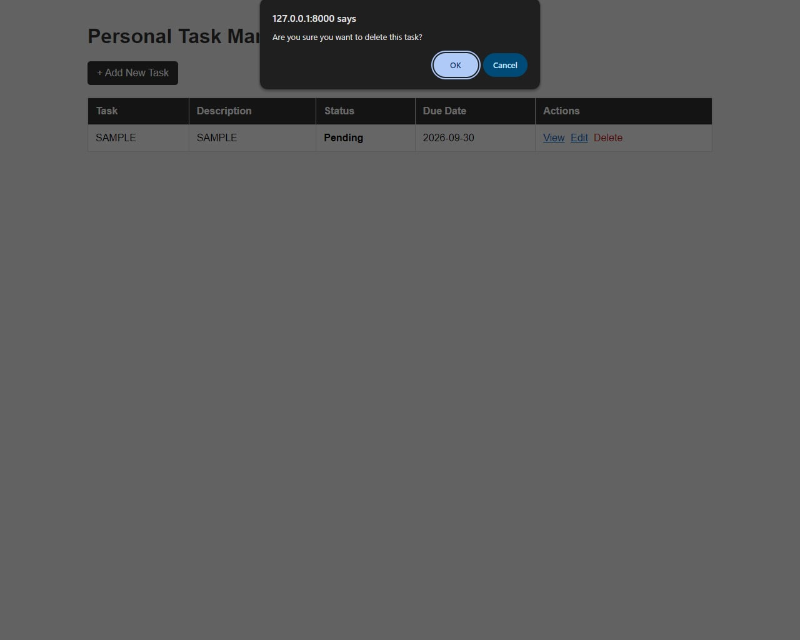

# Personal Task Manager

## Project Code

WST21-PM-2026-SF

## Student Name

Jian Chris Burday

## Course & Year

BSIT 2nd Year

## Database Used

SQLite

## Features

- Add Task
- View Tasks
- Edit Task
- Delete Task
- Update Status

## Screenshots

### Home

### Add Task

### View Tasks

### Edit Task

### Delete Task

## How It Works

### 1. View Tasks

The home page displays all saved tasks. Each task shows its name, description, status, and due date.

### 2. Add a Task

Click the **Add Task** button and fill in the task name, description, status, and due date. Then click **Save Task**.

### 3. Edit a Task

Click the **Edit** button on a task to update its information or change its status. After making changes, click **Update Task**.

### 4. Update Task Status

A task can have either **Pending** or **Completed** status. You can change the status when editing a task.

### 5. Delete a Task

Click the **Delete** button when you want to remove a task from the system.

